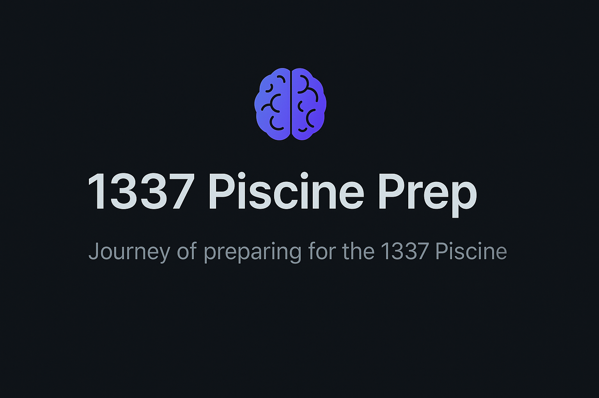

# My Journey to Prepare for 1337 Piscine




Welcome to my repository! This is my dedicated space to document my journey in preparing for the 1337 Piscine, focusing on mastering the C programming language. The plan is structured day by day, progressing from the basics to advanced concepts, with exercises inspired by the rigorous style of 42 School. Dive in with me as I build my skills step by step!

---

## Roadmap

| Day   | Topics                          | Goals                                                   | Status   |
|-------|----------------------------------|---------------------------------------------------------|----------|
| Day 00| Basics                          | Data types, variables, basic I/O, simple math           | ✅ Done |
| Day 01| Control Flow                    | Conditionals (`if`, `else`), loops (`for`, `while`)     | ✅ Done |
| Day 02| Functions & Recursion           | Writing functions, recursion basics                     | ✅ Done |
| Day 03| Arrays                          | 1D/2D arrays, array manipulation                       | ⬜ Not Done |
| Day 04| Pointers                        | Pointer arithmetic, relation to arrays                 | ⬜ Not Done |
| Day 05| String Manipulation             | `str` functions, memory handling for strings           | ⬜ Not Done |
| Day 06| Basic Algorithms                | Sorting, searching, simple recursion problems          | ⬜ Not Done |
| Day 07| Command Line Arguments          | `argc`, `argv`, basic CLI parsing                      | ⬜ Not Done |
| Day 08| Dynamic Memory Allocation       | `malloc`, `free`, memory leaks, `valgrind` basics      | ⬜ Not Done |
| Day 09| Debugging & Compilation         | `gdb`, compiler flags (`-Wall -Wextra -Werror`)        | ⬜ Not Done |
| Day 10| User-Defined Structures         | `struct`, `typedef`, basic linked lists                | ⬜ Not Done |
| Day 11| File Handling                   | `fopen`, `fread`, `fwrite`, file operations            | ⬜ Not Done |
| Day 12| Modular Programming & Headers   | `.h` files, multi-file projects                        | ⬜ Not Done |
| Day 13| Project & Makefile              | Build a small project, write a `Makefile`              | ⬜ Not Done |

---

## Key Additions to the Plan
- **Debugging & Tools**: Learn `gdb` and `valgrind` to catch memory issues early.  
- **Basic Algorithms**: Implement foundational algorithms to improve problem-solving.  
- **Modular Code**: Split code into headers and source files for better organization.  
- **Project Integration**: Combine all concepts into a cohesive project with a `Makefile`.  

---

## How to Use This Repository
1. **Clone the repository**:  
   ```bash
   git clone <repo_url>
